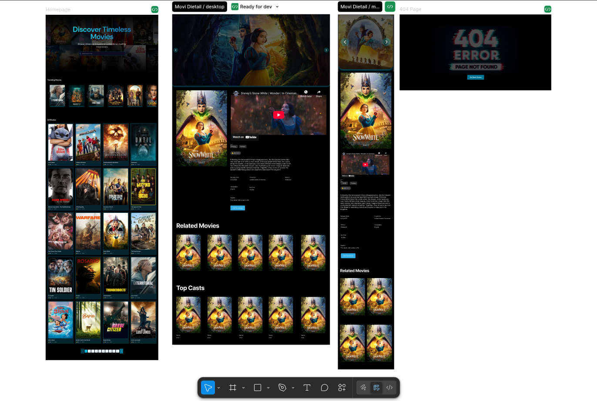
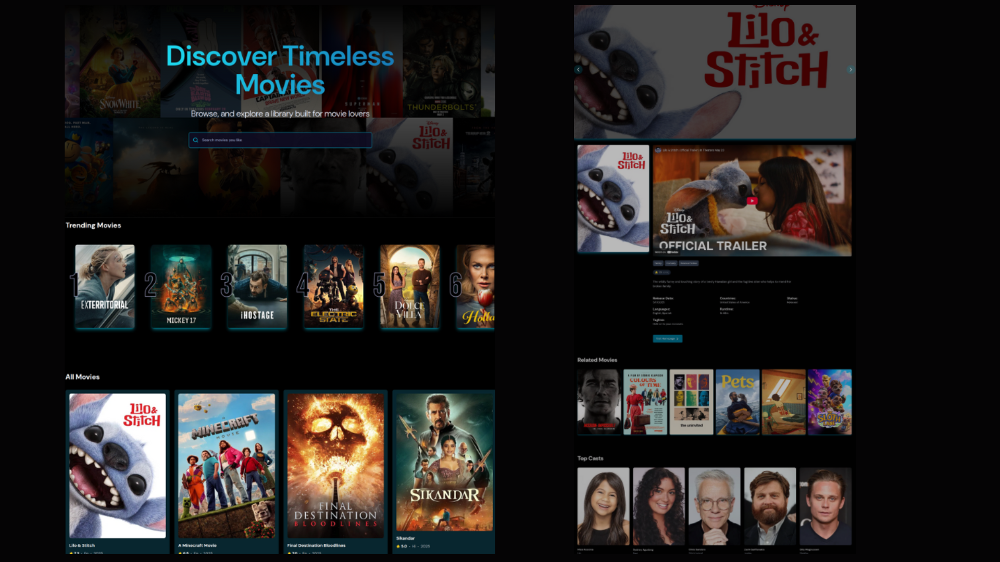

# 🎬 React - Movie App

A sleek and modern movie discovery app built using **React 19**, **Javascript**, **Tailwind CSS**, **Appwrite**, and **The Movie Database (TMDB) API**. Explore trending movies, search for titles, and dive into detailed movie info.

## 🛠 Tech Stack


## ⚙️ Features

- 🔍 **Search** real-time search using `useDebounce` hook from `react-use` to:
  - Debounce the search term to prevent too many API requests
  - Waiting for the user to stop typing for `500ms`
- 📈 **Trending Movies** (Top 10) based on most searched movies.
- 🗂️ **All Movies** with responsive **pagination**.
- 🎞️ **Movie Detail Page** with:
  - Overview, cast, trailer, rating, related movies, and genres. and more!
- ⚠️ Custom **404 page** for invalid routes.
- 📱 Fully **responsive** and mobile-friendly UI.
- ⚡ **Appwrite** for database.

## 📁 Codebase Structure

```bash
public/
├── ├──screenshot/           # for README.md file
├── ├──images/               # images (404 page, hero bg...etc)
src/
├── assets/                  # static assets(favicon)
├── components/              # Reusable UI components
│   ├── movie/               # Movie detail subcomponents
│   ├── pagination/          # Pagination controls
├── pages/                   # Home and Detail routes
├── App.jsx                  # Main router setup
├── appwrite.js              # Appwrite client config
├── .env.local               # Environment Variables
├── index.css                # Tailwind base styles
```

## 🌐 Demo

- Live
<https://movie-dc.netlify.app/>

- Figma design
  

## 🚀 Getting Started

### 1. Clone the Repository

```bash
git clone https://github.com/mohammedalasly/movie-dc.git
cd movie-app
```

### 2. Setup Environment Variables

- Create a *.env.local* file in the root of the project with the following variables
- Make sure to replace these with your actual credentials.

```bash
VITE_TMDB_API_KEY=Your_TMDB_API_KEY.
VITE_APPWRITE_PROJECT_ID=Your_Project_ID
VITE_APPWRITE_DATABASE_ID=Your_Appwrite_DB_ID
VITE_APPWRITE_COLLECTION_ID=Collection_ID
```

### 3. Install Dependencies

```bash
npm install
```

### 4. Run Locally

```bash
npm run dev
```

- Open <http://localhost:5173> in your browser to view the app.


